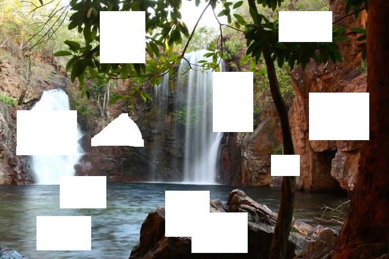
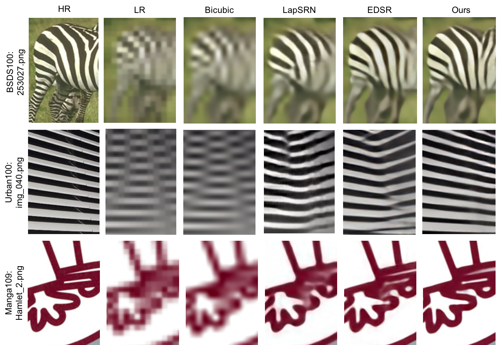

# Funny-CVPR2018
A collection of funny cvpr2018 project

## Image process
- Generative Image Inpainting with Contextual Attention [GitHub](https://github.com/JiahuiYu/generative_inpainting) | [Homepage](http://jhyu.me/posts/2018/01/20/generative-inpainting.html) | [PDF](https://arxiv.org/pdf/1801.07892.pdf)

| Input | Output |
| ----- | ------ |
|  |  |

- Densely Connected Pyramid Dehazing Network [GitHub](https://github.com/hezhangsprinter/DCPDN) | [PDF](https://arxiv.org/pdf/1803.08396.pdf)

| Input | Output |
| ----- | ------ |
|  |  |

- Density-aware Single Image De-raining using a Multi-stream Dense Network [GitHub](https://github.com/hezhangsprinter/DID-MDN) | [PDF](https://arxiv.org/pdf/1802.07412.pdf)

| Input | Output |
| ----- | ------ |
|  |  |

- Deep Back-Projection Networks for Super-Resolution [GitHub](https://github.com/alterzero/DBPN-Pytorch) | [HomePage](https://www.toyota-ti.ac.jp/Lab/Denshi/iim/members/muhammad.haris/projects/DBPN.html) | [PDF](https://arxiv.org/pdf/1803.02735.pdf)

